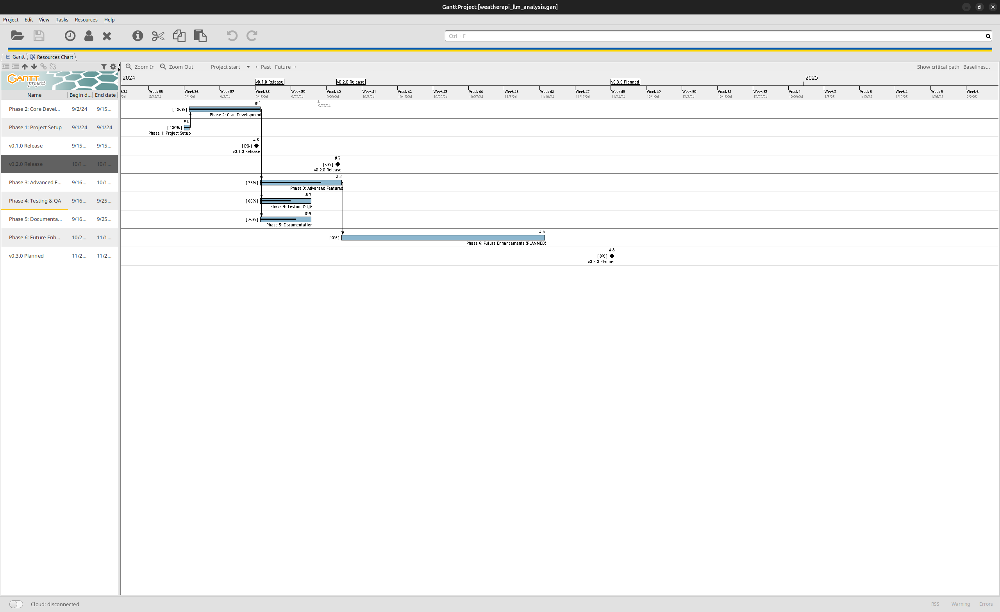

# WeatherAPI Client

A Python client library for accessing weather data from multiple providers.

## Features

- ✅ Multi-provider support (OpenWeather, WeatherStack)
- ✅ Async and sync API
- ✅ Data caching
- ✅ Rate limiting
- 🚧 Historical data queries (in progress)
- 📋 Forecast models (planned)
- 📋 Weather alerts (planned)

## Installation

```bash
pip install weatherapi-client
```

## Quick Start

```python
from weatherapi import WeatherClient

client = WeatherClient(api_key="your_key")
current = client.get_current_weather("New York")
print(f"Temperature: {current.temperature}°C")
```

## Roadmap

### Phase 1: Core Functionality (Completed ✓)
- Basic API client
- Current weather endpoint
- Response models

### Phase 2: Advanced Features (In Progress)
- Historical data queries
- Caching layer
- Multiple providers

### Phase 3: Analytics (Planned)
- Weather pattern analysis
- Forecast models
- Alert notifications

---

## LLM-Generated Project Visualization

This sample package was analyzed using p2gan's LLM-driven workflow. The resulting Gantt chart:



See [HOW_TO_ANALYZE.md](HOW_TO_ANALYZE.md) for details on how this visualization was generated automatically by analyzing the code, git history, and TODO comments.

## Contributing

Contributions welcome! See CONTRIBUTING.md for guidelines.

## License

MIT License
